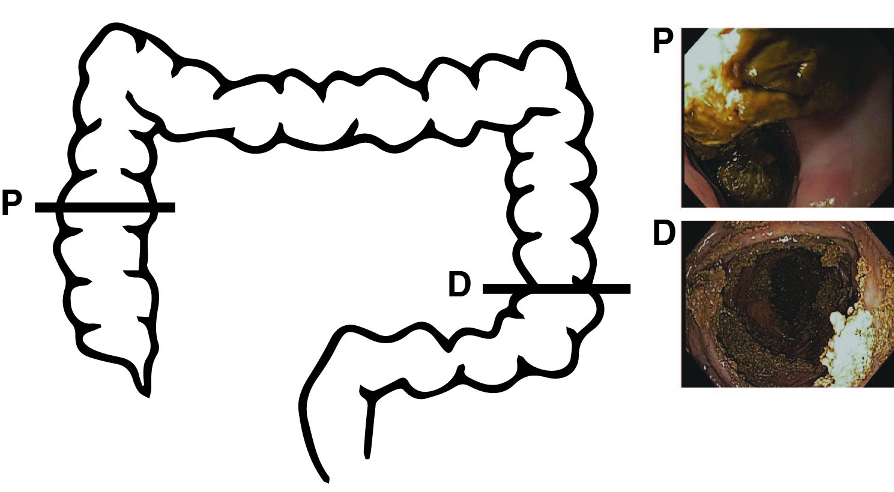

\vspace{15mm}

Running title: Spatial variation of native colon microbiota

\vspace{15mm}


Kaitlin J. Flynn^1^, Charles C. Koumpouras^1^, Mack T. Ruffin IV^2^, D. Kim Turgeon^3$\dagger$^, and Patrick D. Schloss^1$\dagger$^

\vspace{15mm}

$\dagger$ Corresponding authors: kturgeon@umich.edu and pschloss@umich.edu


1\. Department of Microbiology and Immunology, University of Michigan Medical School, Ann Arbor, Michigan 48109

2\. Department of Family and Community Medicine, College of Medicine, Pennsylvania State University, Hershey, Pennsylvania 17033

3\. Department of Internal Medicine, Division of Gastroenterology, University of Michigan Medical School, Ann Arbor, Michigan

Grant support: Rose and Lawrence C. Page Foundation

Disclosures: nothing to disclose

Word count:

Fig.s: 

Supplementary Fig.s: 


\newpage

```{r knitr_settings, eval=TRUE, echo=FALSE, cache=FALSE}
knitr::opts_chunk$set("tidy" = TRUE)
knitr::opts_chunk$set("echo" = FALSE)
knitr::opts_chunk$set("eval" = TRUE)
knitr::opts_chunk$set("warning" = FALSE)
knitr::opts_chunk$set("cache" = FALSE)


#knitr::knit_hooks$set(inline=inline_hook)
```

```{r dependencies, echo=FALSE, warning = FALSE, message=FALSE}
pack_used <- c('randomForest','ggplot2', 'pROC', 'knitr','dplyr','AUCRF', 'tidyr', 'caret', 'RColorBrewer', 'reshape2', 'wesanderson', 'vegan', 'cowplot')
for (dep in pack_used){
  if (dep %in% installed.packages()[,"Package"] == FALSE){
    install.packages(as.character(dep), repos = 'http://cran.us.r-project.org', 
                     quiet=TRUE);
  }
  library(dep, verbose=FALSE, character.only=TRUE)
}
```

```{r datasets, echo=FALSE}
meta <- '../data/raw/kws_metadata.tsv'
shared <- '../data/mothur/kws_final.an.shared'
tax <- '../data/mothur/kws_final.an.cons.taxonomy'
subsample <- read.table(file='../data/mothur/kws_final.an.0.03.subsample.shared', header=T)

meta_file <- read.table(file='../data/raw/kws_metadata.tsv', header = T)
shared_file <- read.table(file='../data/mothur/kws_final.an.shared', sep = '\t', header=T, row.names=2)
tax_file <- read.table(file='../data/mothur/kws_final.an.cons.taxonomy', sep = '\t', header=T, row.names=1)
shared_meta <- merge(meta_file, shared_file, by.x='group', by.y='row.names')

simps <- read.table(file='../data/mothur/kws_final.an.groups.summary', header = T)
simpmeta <- merge(meta_file, simps)

tyc <- read.table(file ="../data/mothur/kws_final.an.summary", sep = '\t', header = T, row.names=NULL)

```

```{r otu_barplot, echo=FALSE}
source('../code/Sum_OTU_by_Tax.R')
source('../code/sum_shared.R')

#use this code to assign phyla to each OTU in the shared file 
sub <- '../data/mothur/kws_final.an.0.03.subsample.shared'
shared_phyla <- get_tax_level_shared(sub, tax, 2)
phyla_met <- merge(meta_file, shared_phyla, by.x='group', by.y='row.names')

#try to get the df organized to work as a boxplot - no median calculation 
phyla_test <- phyla_met[, c("location","Firmicutes","Bacteroidetes","Proteobacteria","Verrucomicrobia","Actinobacteria","Fusobacteria")]
subsampled_to <- 4231
RA <- function(x) 100*x/subsampled_to

phyla_RA <- data.frame(phyla_test[1], apply(phyla_test[2:ncol(phyla_test)],2, RA))
phylaRAnames <- colnames(phyla_RA[,1:7])
phyla_RAmelt <- melt(phyla_RA[, phylaRAnames], id.vars=1)

```

```{r thetayc, echo=FALSE}
tyc <- read.table("../data/mothur/kws_final.an.summary", sep = '\t', header = T, row.names=NULL)

#separate column values for comparisons
tyc <- separate(tyc, label, into= c('pt1', 'samp1'), sep="-", remove=F)
tyc <- separate(tyc, comparison, into= c('pt2', 'samp2'), sep="-", remove=F)
tyc <- subset(tyc, select = -c(row.names, X))

tyc <- subset(tyc, pt1==pt2)
tyc <- unite_(tyc, "match", from=c('samp1', 'samp2'), sep="_", remove = F)

stooltyc <- subset(tyc, match=='LB_RB' | match== 'LS_RS')
distalandproximaltyc <- subset(tyc, match=='LB_LS' | match== 'RB_RS')
lvsr <- rbind(stooltyc, distalandproximaltyc)

exittyc <- subset(tyc, samp2 == 'SS')

pvalues <- c()

Atyc <- subset(tyc, match=='RB_RS' | match=='LS_RS')
pvalues <- c(pvalues, wilcox.test(thetayc~match, data=Atyc, paired=T)$p.value)

btyc <- subset(tyc, match=='RB_RS'| match=='LB_RB')
btyc <- btyc[-25,]
pvalues <- c(pvalues, wilcox.test(thetayc~match, data=btyc, paired=T)$p.value)

ctyc <- subset(tyc, match=='RB_RS'| match=='LB_LS')
ctyc <- ctyc[-25,]
pvalues <- c(pvalues, wilcox.test(thetayc~match, data=ctyc, paired=T)$p.value)

dtyc <- subset(tyc, match == 'LS_RS' | match == 'LB_RB')
dtyc <- dtyc[-25,]
pvalues <- c(pvalues, wilcox.test(thetayc~match, data=dtyc, paired=T)$p.value)

etyc <- subset(tyc, match == 'LS_RS' | match == 'LB_LS')
etyc <- etyc[-25,]
pvalues <- c(pvalues, wilcox.test(thetayc~match, data=etyc, paired=T)$p.value)

ftyc <- subset(tyc, match == 'LB_RB' | match == 'LB_LS')
pvalues <- c(pvalues, wilcox.test(thetayc~match, data=ftyc, paired=T)$p.value)

pvalues <- p.adjust(pvalues, method = "BH")

# now for exit comparisons

stoolpvalues <- c()

htyc <- subset(tyc, match=='RB_SS' | match=='RS_SS')
htyc <- htyc[-25,]
stoolpvalues <- c(stoolpvalues, wilcox.test(thetayc~match, data=htyc, paired=T)$p.value)

ityc <- subset(tyc, match=='RB_SS' | match=='LB_SS')
stoolpvalues <- c(stoolpvalues, wilcox.test(thetayc~match, data=ityc, paired=T)$p.value)

jtyc <- subset(tyc, match=='RB_SS' | match=='LS_SS')
stoolpvalues <- c(stoolpvalues, wilcox.test(thetayc~match, data=jtyc, paired=T)$p.value)

ktyc <- subset(tyc, match=='RS_SS' | match=='LB_SS')
ktyc <- ktyc[-25,]
stoolpvalues <- c(stoolpvalues, wilcox.test(thetayc~match, data=ktyc, paired=T)$p.value)

ltyc <- subset(tyc, match=='RS_SS' | match=='LS_SS')
ltyc <- ltyc[-25,]
stoolpvalues <- c(stoolpvalues, wilcox.test(thetayc~match, data=ltyc, paired=T)$p.value)

mtyc <- subset(tyc, match=='LB_SS' | match=='LS_SS')
stoolpvalues <- c(stoolpvalues, wilcox.test(thetayc~match, data=mtyc, paired=T)$p.value)

stoolpvalues <- p.adjust(stoolpvalues, method = "BH")

alltyc <- read.table("../data/process/allshared.summary", sep = '\t', header = T, row.names=NULL)
alltyc <- separate(alltyc, label, into= c('pt1', 'samp1'), sep="-", remove=F)
alltyc <- separate(alltyc, comparison, into= c('pt2', 'samp2'), sep="-", remove=F)
alltyc <- alltyc[-1]
alltyc <- alltyc[-7]

#ultimately want a plot of all points where pt1 == pt2 in one bar and all of the others in another column 
#unite and make column of 0/1 for matches? then can plot 1 and 0s 
#should i separate out lumen and mucosa ? sure or no not for now

alltyc["same_pt"] <- NA

for (i in 1:nrow(alltyc)){
  if (alltyc$pt1[i] == alltyc$pt2[i]){
    alltyc$same_pt[i] <- 1
  }
  else alltyc$same_pt[i] <- 0
}

inter_medians <- aggregate(thetayc ~ same_pt, alltyc, median)
```

```{r randomforest, echo=FALSE}

#update this to just be importing end files off of optimization scripts to pull AUCs from
```


### Abstract

The microbiome has been implicated in the development of colorectal cancer (CRC) and inflammatory bowel diseases (IBD). The specific traits of these diseases vary along the axis of the digestive tract. Further, variation in the structure of the gut microbiota has been associated with both diseases. Here we profiled the microbiota of the healthy proximal and distal mucosa and lumen to better understand how bacterial populations vary along the colon. We used a two-colonoscope approach to sample proximal and distal mucosal and luminal contents from the colons of 20 healthy subjects that had not undergone any bowel preparation procedure. The biopsies and home-collected stool were subjected to 16S rRNA gene sequencing and Random Forest classification models were built using taxa abundance and location to identify microbiota specific to each site. The right mucosa and lumen had the most similar community structures of the five sites we considered from each subject. The distal mucosa had higher relative abundance of Finegoldia, Murdochiella, Peptoniphilus, Porphyromonas and Anaerococcus. The proximal mucosa had more of the genera Enterobacteriaceae, Bacteroides and Pseudomonas. The classification model performed well when classifying mucosal samples into proximal or distal sides (AUC=0.850). Separating proximal and distal luminal samples proved more challenging (AUC=0.580) and specific microbiota that differentiated the two were hard to identify. By sampling the unprepped colon, we identified distinct bacterial populations native to the proximal and distal sides. Further investigation of these bacteria may elucidate if and how these groups contribute to different disease processes on their respective sides of the colon.
 
Words: 259/260

Keywords: microbiome; colon cancer; proximal and distal colon

### Introduction

The human colon is an ecosystem comprised of numerous microenvironments that select for different microbiota. Concentrations of oxygen, water and anti-microbial peptides change along the gut axis and influence which microbiota reside in each location. Microenvironments differ not only longitudinally along the colon, but also radially from the epithelium to mucosa to intestinal lumen, offering several sites for different microbial communities to flourish. The identity of these specific microbiota and communities are important for understanding the etiology of complex colon diseases such as Colorectal Cancer (CRC) and Inflammatory Bowel Disease (IBD). CRC and IBD can be preceded or accelerated by perturbations the structure of the gut microbiota [@Yamauchi2012; @Forbes2016; @Halfvarson2017]. The manifestations of these diseases are known to vary based upon the location in which they occur. For instance, CRC that arises in the distal (left) colon are of hindgut origin and tend to have large chromosomal alterations indicative of chromosomal instability @Yamauchi2012. In contrast, CRC arising in the proximal (right) colon tumors are of midgut origin and tend to be sessile and microsatellite instable (MSI with BRAF and KRAS mutations) @Yamauchi2012. In addition to the environmental gradients within the colon, the distal and proximal sides of the colon differ in the amount of inflammation present and the genomic instability of precancerous cells, respectively [@Yamauchi2012; @Albenberg2014; @Donaldson2015]. In IBD patients, disease occurring in the distal colon extending proximally is usually indicative of ulcerative colitis (UC), whereas Crohn's disease (CD) can occur anywhere along the GI tract, most commonly in the ileum and the cecum @Forbes2016. UC presents as continuous disease with only mucosal involvement, where as CD has skip lesions and full thickness involvement that may cause abscesses, strictures and fistulas @Forbes2016. Thus, given the varied physiology of the proximal-distal axis of the colon and known differences in disease patterns at these sites, symbiotic microbiota and their metabolites likely vary as well, and may influence the heterogeneous disease prognoses of IBD and CRC. Because CRC can be a long-term complication of IBD, the distribution of microbiota is important to understanding the pathophysiology of both diseases. 

Several recent findings have shown that development and progression of IBD or CRC can be attributed to specific molecular events as a result of interactions between the gut microbiota and human host [@Yamauchi2012; @Kostic_2013; @Halfvarson2017]. For instance, comparison of the bacteria present on CRC tumors with those found on nearby healthy tissue has identified specific species that are tumor-associated @Dejea2014. Specific bacteria have also been identified in fecal samples of patients with varying stages of colon tumorigenesis [@McCoy_2013; @Baxter2016]. These species include the oral pathogens _Fusobacterium nucleatum_ and _Porphyromonas asacharolytica_.  _F. nucleatum_ has also been found to be elevated in the stool and biopsies of patients with IBD as compared to healthy controls [@Strauss2011; @Brennan_2016]. Furthermore, studies of _F. nucleatum_ isolated from mucosal biopsies showed that more invasive  _F. nucleatum_ positively correlates with IBD disease level @Strauss2011. Like many intestinal pathogens, the bacteria appear to have a high-impact despite being lowly-abundant in the community @Forbes2016. The physiology of these rare taxa may contribute to the colonic disease state. These studies often examined only shed human stool or the small intestine, preventing fine-resolution analysis of paired samples from the proximal and distal sides of the colon. Similarly, comparisons of on- or off-tumor/lesion bacteria rarely have matched tissue from the other side of the colon from the same, disease-baring patient, limiting what conclusions can be drawn about the colonic microbiome overall, let alone at that specific site. Due to these limitations, the contribution of the gut microbiota to CRC and IBD disease location in the colon is largely undefined. Characterizing these communities in healthy individuals could provide needed insight into disease etiology, including how the disruption of the healthy community could promote the initiation or proliferation of the distinct proximal and distal CRC tumors or IBD flares.

The few existing profiles of the microbial spatial variation of the colon have been limited by sample collection methods. The majority of human gut microbiome studies have been performed on whole shed feces or on samples collected during colonoscopy or surgery. While the latter method allows investigators to acquire samples from inside the human colon, typically these procedures are preceded by the use of bowel preparation methods such as the consumption of laxatives to cleanse the bowel. Bowel preparation is essential for detecting cancerous or precancerous lesions in the colon, but complicates microbiome profiling as the chemicals strip the bowel of contents and disrupt the mucosal layer [@Jalanka2014; @Harrell2012]. As such, what little information we do have about the spatial distribution of the microbiota in the proximal and distal colon is confounded by the bowel preparation procedure. 

Here we address the limitations of previous studies and identify the microbes specific to the lumen and mucosa of the proximal and distal healthy human colon. We used an unprepared colonoscopy technique to sample the natural community of each location of the gut without prior disruption of the native bacteria in 20 healthy volunteers. To address the inherent inter-individual variation in microbiota, we used a machine-learning classification algorithm trained on curated 16S rRNA sequencing reads to identify the microbiota that were specific to each location. We found that our classification models were able to separate mucosal and luminal samples as well as differentiate between sides of the colon based on populations of particular microbiota. By identifying the distinguishing microbiota we are poised to ask if and how the presence or disruption of the microbiota at each site contribute to the development of the tumor subtypes of CRC in the proximal and distal human colon. 

### Methods
#### Human subjects
The procedures in this study and consent were approved by the Institutional Review Board at the University of Michigan Health System with protocol number HUM00082721. Subjects were recruited using the online recruitment platform and were pre-screened prior to enrollment in the study. Exclusion criteria included: use of asprin or NSAIDs within 7 days, use of antibiotics within 3 months, current use of anticoagulants, known allergies to Fentanyl or Benadryl, prior history of colon disease, diabetes, abdominal surgery, respiratory, liver, kidney or brain impairments, undergoing current chemotherapy or radiation treatment and subjects that were pregnant or trying to conceive. 20 subjects that met the criteria were selected and provided signed informed consent prior to the procedure. There were 13 female and 7 male subjects ranging in age from 25 to 64. 

#### Sample collection
At a baseline visit, subjects gave consent and were given a home collection stool kit (Zymo). At least one week prior to the scheduled colonoscopy, subjects collected whole stool at home and shipped the samples to a research coordinator on ice. Notably, subjects did not undergo any bowel preparation method prior to sampling. On the procedure day, subjects reported to the Michigan Clinical Research Unit at the University of Michigan Health System. Subjects were consciously sedated using Fentanyl, Versed and/or Benadryl as appropriate. A flexible sigmoidoscope was first inserted about 25cm into the colon and jumbo biopsy forceps used to collect the luminal contents. Two luminal samples were collected and the contents immediately deposited into RNAlater (Fischer) and flash-frozen in liquid nitrogen. The forceps were withdrawn and new biopsy forceps were used to collect mucosal biopsies on sections of the colon that were pink and free of stool matter. Three mucosal biopsies were collected and flash-frozen in RNAlater. These samples comprised the distal colon samples. The sigmoidoscope was then withdrawn and a pediatric colonoscope was inserted to reach the proximal colon. Samples were then collected in the same manner as was done in the distal colon and the colonoscope withdrawn. All samples were stored at -80$^\circ$C.

#### Sample processing, sequencing and analysis
DNA extraction was performed using the PowerMicrobiome DNA/RNA Isolation Kit (MO BIO Laboratories). For tissue biopsies, Bond-Breaker TCEP solution (Fisher) and 2.8mm ceramic beads (MO BIO Laboratories) were added to the bead beating step to enhance DNA recovery from mucosal samples. The resulting DNA was used as template for amplification of the V4 region of the 16S rRNA gene and fragments were sequenced on an Illumina MiSeq as previously described @Kozich2013. Sequences were curated using the mothur software as described previously @Schloss2009. The sequences were assigned a taxonomic classification using a naive Bayesian classifier trained using a 16S rRNA gene training set from the Ribosomal Database Project (RDP) @Wang2007 and clustered into operational taxonomic units (OTUs) based on a 97% similarity cutoff. Sequencing and analysis of a mock community revealed the error rate to be 0.018%. Samples were rarefied to 4231 sequences per sample in order to reduce uneven sampling bias. 

Diversity analysis was performed using the Simpson diversity calculator and $\theta$<sub>YC</sub> calculator metrics in mothur version 1.39.5 @Schloss2009. $\theta$<sub>YC</sub> distances were calculated to determine the dissimilarity between two samples. Random Forest classification models were built using the AUCRF R package using a leave-one-subject out approach @Calle_2011. For each model the data was split into a 19-subject training set and a 1-subject test set. The model was built and cross-validated using AUCRFcv on the training set. The model was then tested on the left-out patient. This process was repeated iteratively for all subjects and results plotted as Reciever Operator Characteristic curves using the pROC R package @Robin_2011. Resultant models were used to identify the OTUs that were most important for classifying each location. Species-level information for sequences of interest was obtained by aligning the sequences to the GenBank nucleotide databse using blastn. The species name was only used if the identity score was $\ge$ 99% over the full-length of the contig and matched a single reference. 

#### Statistical analysis
Differences in community membership at the phyla level were tested using the analysis of molecular variance (AMOVA) metric in mothur. Differences in $\theta$<sub>YC</sub> distances by location were tested using the Wilcoxon rank-sum test adjusted for multiple comparisons using the Benjamini-Hochberg procedure.

#### Data availability
16S rRNA gene sequence reads and experiment metadata are available on the NCBI Sequence Read Archive (SRA) with accession number XXXX. A reproducible data analysis pipeline can be found at https://github.com/SchlossLab/Flynn_LRColon_XXXX_2017.

### Results

#### Microbial membership and diversity of the proximal and distal colon 
Luminal and mucosal samples were collected from the proximal and distal colon of 20 healthy humans that had not undergone bowel preparation (Fig. 1). Subjects also collected stool at home one week prior to the procedure. To characterize the bacterial communities present at these sites, 16S rRNA gene sequencing was performed on DNA extracted from each sample. As expected, each site was primarily dominated by _Firmicutes_ and _Bacteriodetes_ (Fig. 2A) @LloydPrice2016. Samples had varying levels of diversity at each site, irrespective of the individual (Fig. 2B). For example, the proximal mucosa was more diverse than the distal for some individuals while the opposite was true for others. Therefore we could not identify a clear pattern of changes in microbial diversity along the gut axis. 

To compare similarity between the proximal and distal sides and within the lumen and mucosa, we compared the community structure of these sites based on the relative abundances of individual Operational Taxonomic Units (OTUs). Across all subjects we observed wide variation when comparing sample locations (Fig. 3A). Those ranges did not follow a clear pattern on an individual basis. However, when comparing median dissimilarity between the communities found in the proximal lumen and mucosa, the proximal and distal lumen, the proximal and distal mucosa, and the distal lumen and mucosa, we found that the proximal lumen and mucosa were most similar to each other than to the other samples (P < 0.005, Wilcoxon, BH adjustment). 

#### Fecal samples resemble luminal samples from the distal colon 
Next, we compared the luminal and mucosal samples to the fecal sample of each subject. Amidst the large inter-subject variation, we did identify significantly less dissimilarity between the distal luminal sample and the feces (Fig. 3B, P < 0.05, Wilcoxon, BH adjustment). Furthermore, there was an even larger difference in the communities found in the distal mucosa compared to the fecal communities, indicating that the mucosa is as different from the stool as compared to lumen (P < 0.0005, Wilcoxon, BH adjustment). These results suggest that the contents of the distal lumen were most representative of the subjects' feces, and the mucosal microbiota are distinct from the fecal and luminal communities. 

#### Interpersonal community variation is greater than the variation between sites
To determine what factors may have driven the differences seen among the samples, we compared the community dissimilarity between samples from all subjects (interpersonal) versus samples from within one subject (intrapersonal). We found that samples from one individual were far more similar to each other than to matched samples from the other subjects (Fig. 3C); this is consistent with previous human microbiome studies that have sampled multiple sites of the human colon [@Eckburg2005; @deCarcer2010; @Zhang2013]. Thus interpersonal variation drove the differences between samples more than whether the sample came from the proximal or distal side of the colon or from the lumen or mucosa. 

#### Random Forest classification models identify important Operational Taxonomic Units (OTUs) on each side
To identify OTUs that were distinct at each site, we constructed several Random Forest models trained using OTU relative abundances. We used 10-fold cross validation to build the first model to classify the luminal versus mucosal samples for the proximal and distal sides, independently (Fig. 4A). The models performed well when classifying these samples (proximal AUC = 0.764, distal AUC = 0.908). The OTUs that were most predictive of each site were identified by their greatest mean decrease in accuracy when removed from the model. For distinguishing the proximal lumen and mucosa, OTUs affiliated with the _Bacteriodes_, _Actinomyces_, _Psuedomonas_ and _Enterobacteraceae_ were included in the best model (Fig. 5A). The model to differentiate between the distal lumen and mucosa included OTUs affiliated with the _Turicibacter_, _Finegoldia_, _Peptoniphilus_ and _Anaerococcus_ (Fig. 5B). These results indicated that there were fine differences between the different sites of the colon, and that these could be traced to specific OTUs on each side. 

Next, we built a Random Forest model to differentiate the proximal and distal luminal samples using 10-fold cross validation. The model performed best when distinguishing the proximal versus distal mucosa (Fig. 4B, AUC = 0.850) whereas the model to differentiate between the proximal versus distal lumen performed poorly (AUC = 0.580). The OTUs included in the model differentiating the distal and proximal mucosa included members of the _Porphyromonas_, _Murdochiella_, _Finegoldia_, _Anaerococcus_ and _Peptoniphilus_ (Fig. 6A). The model that attempted to separate the the proximal and distal lumen included OTUs affiliated with the _Bacteroides_, _Clostridium IV_ and _Oscillibacter_ (Fig. 6B). Interestingly, _Anaerococcus_ and _Finegoldia_ were distinct between the mucosa and lumen and also helped to differentiate between the proximal and distal sides. 

#### Bacterial OTUs associated with CRC and IBD are found in healthy individuals 
Given that specific bacterial species have been associated with colorectal cancer and IBD, we probed our sample set for these OTUs. Among our 100 samples, the most frequent sequence associated with the _Fusobacterium_ genus was OTU179, which aligned via blastn to _Fusobacterium nucleatum subsp animalis_ (100% over full length). This is the only species of _Fusobacterium_ known to have oncogenic properties and be found on the surfaces of colorectal cancer tumors @Castellarin2011. There were 14 samples from 8 subjects with the _F. nucleatum subsp. animalis_ sequences. Of the samples with the highest relative abundance of _F. nucleatum subsp. animalis_, four of the samples were from the proximal mucosa and three from the distal mucosa (Supplementary Fig. S1A). The second most frequent _Fusobacterium_ sequence was OTU472, which aligned with 99% identity to _F. varium_. In addition to _F. nucleatum_, _F. varium_ has been associated with IBD @Lee2016. Four subjects harbored _F. varium_ and the samples were split evenly between the proximal and distal mucosa (Supplementary Fig. S1B). OTU152 was similar to the members of the _Porphyromonas_ genus and the most frequent sequence in that OTU aligned to _Porphyromonas asacharolytica_ (99% over full length), another bacterium commonly detected and isolated from colorectal tumors. OTU152 was only detected on the distal mucosa, and in fact was one of the OTUs the classification model identified as separating distal and proximal sides (Supplementary Fig. S1C). Among the 11 distal mucosa samples that were positive for _P. asacharolytica_, the relative abundances for this OTU ranged from 0.01% to 16%. Thus, disease-associated OTUs could be found in our sample set of 20 healthy individuals. 

### Discussion
Here we identified bacterial taxa that were specific to the lumen and mucosa of the proximal and distal sides of the human colon using samples collected during an unprepared colonoscopy of healthy subjects. We found that all locations contained a range of phyla relative abundances and a range of diversity, but that there was a wide variability between subjects. Pairwise comparisons of each of the sites revealed that the proximal mucosa and lumen were most similar to each other. Further, comparison of colonoscopy-collected samples with fecal samples demonstrated that the distal lumen was most similar to feces. Random Forest models built using OTU relative abundances from each sample identified microbiota that were particular to each location of the colon. Finally, we were able to detect some bacterial OTUs associated with colonic disease in our healthy cohort. Using unprepped colonoscopies and machine learning, we have identified bacterial taxa specific to the healthy proximal and distal human colon. 

When examining the relative abundance of the dominant phyla at each site (i.e. _Bacteriodes_ and _Firmicutes_), there was a wide amount of variation. This likely reflects not only the variability between human subjects, casued by differences in age, sex, diet, but also spatial "patchiness" in the gut microbiome. One study noted that the bacteria recoverable from the same mucosal sample location can be vastly different when the samples are taken just 1 cm away from each other @Hong2011. Similar patchiness was also observed in luminal contents and fecal samples themselves; there was separation of different interacting microbes along the length of a stool sample, for instance @Stearns2011. That said, across our samples, the mucosal samples harbor more _Proteobacteria_, consistent with previous studies comparing mucosal swabs to luminal content in humans @Albenberg2014. Hence, the conclusions we were able to draw from phyla analysis may have been impacted by inter-subject patchiness. 

To get around the noisiness from a diverse set of samples, we built Random Forest classification models to identify the microbiota that were specific to each side and in the lumen and mucosa. For each comparison we identified the top five OTUs that were strongly predictive of one site or another. Generally, OTUs identified in each location were consistent with known physiological gradients along the gut axis @Donaldson2015. For instance, the proximal mucosa contains the highest oxygen concentrations of the colon and  harbored mucosa-associated facultative anaerobes such as _Actinomyces_ and _Enterobacteraceae_ and aerobic _Psuedomonas_. The distal mucosa was far more likely to host strictly anaerobic species such as _Porphyromonas_, _Anaerococcus_, _Finegoldia_ and _Peptoniphilus_. Thus the gut microenvironment of each location likely enriches for these specific microbiota. 

In addition to identifying features that are specific to each side of the gut, the ability of the Random Forest to classify samples can serve as a proxy for similarity. That is, a higher AUC value indicates the samples are more efficiently classfied (and thus more different) than a model with a lower AUC value. For instance, the model separating the proximal and distal mucosa had an AUC of 0.850 whereas the model for classifying the proximal and distal lumen had a much lower AUC of 0.580. Further, the latter model required 44 OTUs to best separate the samples whereas the models separating the mucosa only needed 10 OTUs. The much lower AUC and need for a high number of features compared to other models suggest these locations are the most similar of the comparisons tested. We speculate that the model was less effective at classifying the proximal and distal luminal contents because the mucosal microenvironments have variable selective pressure along the colon than the luminal microenvironments. 

We detected _F. nucleatum_ and _P. asacharolytica_ in 8 and 5 of our subjects, respectively. These bacteria have been shown to be predictive of colorectal cancer in humans @Baxter2016 and have oncogenic properties in cell culture and in mice @Sears2014. Interestingly, while _F. nucleatum_ was found on both sides of the colon, _P. asacharolytica_ was only detected in the distal mucosa. Not much is known about the distribution of _P. asacharolytica_ along the colon, but given its anaerobic lifestyle and asacharolytic metabolism, it is not surprising that it resides in the less-oygen-rich and protein-rich distal mucosa @Albenberg2014. In studies examining bacteria on colorectal cancer tumors, _F. nucleatum_ was more commonly detected on proximal-sided tumors, and distribution of _F. nucleatum_ decreased along the colon to rectum @Mima2016. In another study, _Fusobacterium_ was associated with MSI with BRAF and KRAS mutations, molecular features of proximal CRC @Tahara_2014. Of the 8 (40%) individuals positive for _F. nucleatum_ in the present study, the bacterium was spread across the proximal mucosa, distal lumen and distal mucosa. Data examining bacterial biofilms on the mucosa of CRC tumors suggests that _Fusobacteria_ species are more commonly found on proximal tumors and in biofilms, indicating that it is not only the presence of the bacterium but the structure of the tumor community that contributes to _Fusobacterium's_ role in tumorigenesis @Dejea2014. Finally, _Fusobacterium_ and _Porphyromonas_ populations not only co-occur on CRC tumors but also to synergize to promote tumorigenesis in an oral cancer model @Whitmore2014 @Flynn2016. Further analysis of the distribution and activities of these pathogens along the colon is needed to elucidate a mechanism for development of CRC or IBD subtypes in the proximal or distal colon. 

The _Fusobacterium_ species _nucleatum_ and _varium_ have been commonly isolated from mucosal biopsies of patients with IBD @Lee2016. Laboratory experiments with these isolates have shown that disease-isolated _F. nucleatum_ are more invasive and stimulate more TNF-$\alpha$ production than strains from healthy individuals @Strauss2011, suggesting the bacteria may increase inflammation in the gut as well @Dharmani2011. _F. varium_ isolated from UC patients caused colonic ulcers in an experimental mouse model @Ohkusa2003. _F. varium_ was only detected in three subjects and two of those samples were isolated form the proximal mucosa (Supplementary Fig. S1B).  _F. varium_ is most commonly isolated from UC patient biopsies from the ileum or cecum @Ohkusa2002, suggesting this species may exhibit preference for the different environmental conditions of these gastrointestinal sites. Further work will assess how gut environment may select for species which may then cause localized disease. 

Specific comparisons of our findings to previously published studies of spatial variation are confounded by the use of bowel preparation methods. A rare report of a matched-colonoscopy study sampled 18 patient's colonic mucosa and luminal contents prior to and after bowel cleansing @Shobar2016. This study found that mucosal and luminal samples were distinguishable prior to bowel cleansing, but that bowel preparation resulted in an increase in shared OTUs between each site @Shobar2016. After seven days, bowel cleansing not only made the samples more difficult to distinguish, but it also decreased the diversity observed across sites. Bowel preparation clearly biases the representation of microbiota recovered from sampling the lumen or mucosa.  

By revealing specific differences in microbial populations at each location in the gut via sampling an unprepared bowel, we can begin to form hypotheses about how specific host-microbe interactions can affect disease progression of proximal and distal CRC and IBD subtypes. A better understanding of microbial activities in the gut can enhance microbiome-based screening and treatment modalities for these colon diseases.   

### Acknowledgments 
We thank all the individuals who volunteered for the study. This work was supported by the Rose and Lawrence C. Page Foundation (DKT). We would also like to thank Brian Kleiner, Chelsea Crofoot, and Kirk Herman for their roles in study coordination, subject recruitment, sample collection and sample processing. <need grant # here>


\newpage

### References 

<div id="refs"></div>

\newpage

### Figures

####Figure 1
Sampling strategy. A flexible sigmoidoscope was used to sample the distal colonic luminal contents and mucosa. The scope was inserted ~ 25cm into the subject and biopsy forceps were used to sample the luminal contents (D, inset). A separate set of biopsy forceps was used to sample the distal mucosa (D, inset). The sigmoidoscope was removed. A pediatric colonoscope was inserted and used to access the proximal colon (P, inset). Biopsies were taken of the proximal luminal contents and mucosa as described. One week prior to the procedure stool was collected at home and sent into the laboratory. Representative images from one individual are shown.



\newpage

####Figure 2
Phylum-level relative abundance and diversity in the proximal and distal human colon. A) Relative abundance of the top five bacterial phyla in each sampling site. Each box represents the median and interquartile range. B) Simpson diversity of the microbial communities at each location. The horizontal lines represent the median values. 


\newpage

####Figure 3
Comparison of microbial community structure between sites of the gut. $\theta$<sub>YC</sub> distances are shown to indicate the interpersonal dissimilarities between two sites – each point represents one individual. In (A), comparisons of the proximal and distal mucosal and lumen are shown. In (B), comparisons of each site to the exit stool are shown. In (C), comparisons of samples from all subjects to each other (interpersonal) or within one subject (intrapersonal) are shown. 


\newpage

####Figure 4
Random Forest classifies locations in the colon. A) Receiver Operator Characteristic curves are shown for the 10-fold cross validation of the Random Forest model classifying lumen and mucosal samples for the distal (red) and proximal (blue) sides of the colon. (B) Receiver Operator Characteristic curves are shown for the 10-fold cross validation of the Random Forest model classifying distal mucosa vs proximal mucosa (green) and distal lumen versus proximal lumen (purple).


\newpage
####Figure 5
Taxa specific to the distal and proximal sides of the colon. Top five OTUs that are most important for the classification model for the distal mucosa and lumen (A) and the proximal mucosa and lumen (B). The vertical lines represent the median values for each OTU. 


\newpage

####Figure 6 
Taxa specific to the distal and proximal mucosa and lumen. The five OTUs that were most important differentiating the distal and proximal mucosa (A) and the distal and proximal lumen (B). The vertical lines represent the median values for each OTU.


\newpage

####Figure S1
Location and relative abundance of cancer-associated OTUs. Relative abundance was calculated and plotted by sample site for each OTU of interest: (A) _Fusobacterium nucleatum subsp. animalis_ (B) _Fusobacterium varium_ and (C) _Porphyromonas asacharolytica_ 


\newpage


